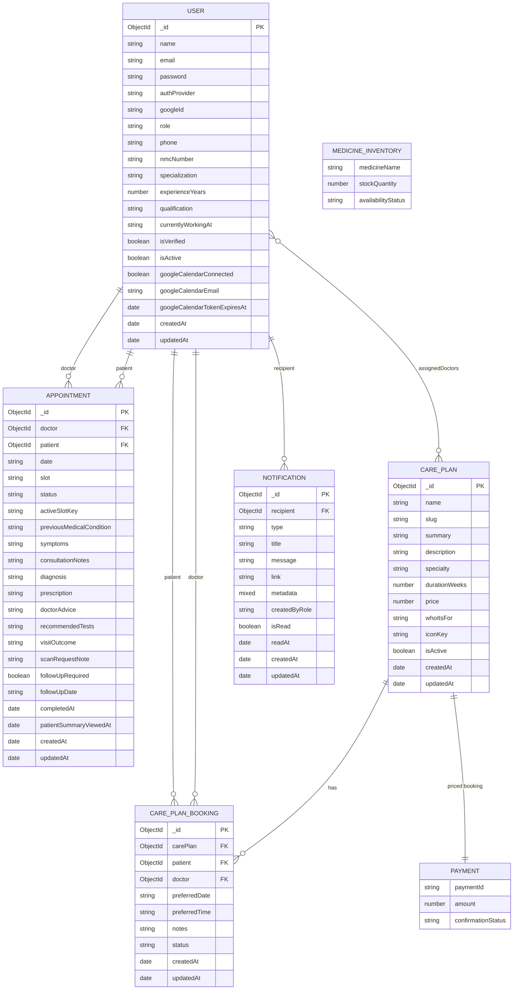

# MEDISCAN FYP TECHNICAL REPORT

---

# 1. PROJECT BRIEFING

## 1.1 System Purpose

`MediScan` is a full-stack healthcare web application implemented as an npm workspace monorepo inside `app/`. The system combines:

- a public-facing patient portal
- a verified doctor directory
- an AI-assisted symptom checker
- appointment booking and follow-up management
- booking confirmation payment handling
- care plan publishing and booking
- simple medicine inventory tracking
- role-based workspaces for `patient`, `doctor`, and `superadmin`

At code level, the system is built around:

- a backend REST API in `app/api/src`
- a frontend React single-page application in `app/client/src`
- MongoDB models in `app/api/src/database/models`

## 1.2 Problem Being Solved

The application addresses several connected problems in outpatient digital care:

- patients need a simple way to discover verified doctors and request appointments
- doctors need a controlled workflow to review, confirm, reject, reschedule, complete, and document consultations
- superadmins need central control over user verification, blocking, deletion, and care plan publication
- patients need post-consultation visibility into summaries, prescriptions, requested scans, and follow-up actions
- patients with ongoing issues need structured doctor-led `care plans`
- appointment workflows need payment completion at booking confirmation
- administrators and clinical staff need a simple medicine inventory reference for stock visibility
- users need a preliminary symptom-triage tool before deciding on self-care, clinic care, urgent care, or emergency escalation

## 1.3 End Users

The actual end-user roles found in the code are:

- `patient`
- `doctor`
- `superadmin`

Supporting external/system actors also exist:

- Google OAuth identity provider
- Google Calendar API
- SMTP email service
- AI provider configured through `MISTRAL_API_KEY` or `OPENROUTER_API_KEY`

## 1.4 High-Level Working Flow

At a high level, the system works as follows:

1. A user registers through `POST /api/auth/register` or signs in through `POST /api/auth/login`.
2. `auth.middleware.js` verifies the JWT and sets `req.user`.
3. Role-based frontend routes in `src/App.jsx`, `RoleRoute.jsx`, and `SuperadminRoute.jsx` open the correct workspace.
4. Patients can:
   - browse doctors from `GET /api/users/doctors`
   - inspect doctor availability from `GET /api/appointments/doctor/:doctorId/availability`
   - request appointments through `POST /api/appointments`
   - complete payment at booking confirmation
   - browse care plans from `GET /api/care-plans`
   - request care plans through `POST /api/care-plans/:id/book`
   - use the symptom checker through `POST /api/symptoms/analyze`
5. Doctors can:
   - review appointment queues from `GET /api/appointments/doctor/me`
   - confirm or reject requests through `PATCH /api/appointments/:id/status`
   - write consultation notes with `PATCH /api/appointments/doctor/me/:id/consultation`
   - manage availability through `PUT /api/appointments/doctor-settings/me`
   - review patient timelines through `GET /api/appointments/doctor/me/patients/:patientId/record`
   - manage care plan requests through `PATCH /api/care-plans/bookings/doctor/:id/status`
6. Superadmins can:
   - manage all users with `GET /api/users`, `PUT /api/users/:id`, `PATCH /api/users/:id/verify-doctor`, `PATCH /api/users/:id/block`, `PATCH /api/users/:id/activate`, and `DELETE /api/users/:id`
   - manage care plans through `/api/care-plans/admin/*`
7. The backend creates in-app notifications via `createNotification()` and optionally emails through `sendNotificationEmail()` and `sendWelcomeEmail()`.
8. The wider service workflow also includes payment completion at booking confirmation and a simple medicine inventory record for stock tracking.

---

# 2. AIMS

1. To provide a centralized digital healthcare platform for patient triage, doctor discovery, appointment handling, booking confirmation payment, medicine inventory awareness, and structured follow-up care.
2. To improve the coordination between patients, doctors, and administrators through role-based workflows, automated notifications, and persistent medical interaction records.

---

# 3. OBJECTIVES

1. To enable patients to register, authenticate, and access healthcare services online.
2. To allow doctors to maintain controlled appointment schedules and manage consultation workflows.
3. To support superadmin governance over doctor verification, patient and doctor account status, and overall platform data quality.
4. To help patients identify the urgency of symptoms through AI-assisted and fallback rule-based symptom analysis.
5. To provide a doctor discovery feature that exposes only `isVerified` doctor profiles for public booking.
6. To preserve consultation continuity through appointment history, medical document uploads, and timeline-style patient records.
7. To support structured longer-term treatment pathways through doctor-assigned care plans and care plan booking requests.
8. To notify users about appointment requests, confirmations, cancellations, reminders, follow-ups, care plan actions, and scan/report requests.
9. To support booking confirmation payment and maintain a simple medicine inventory for basic medicine availability tracking.

---

# 4. ARTEFACT OVERVIEW

## 4.1 System Overview

`MediScan` is a modular monolithic web system. The application is not split into independent deployable microservices; instead, it is organized into backend modules under `app/api/src/modules` and consumed by a single React SPA in `app/client/src`.

The codebase contains three main layers:

- **Presentation layer**: React pages, layouts, dialogs, route guards, dashboards
- **Application/service layer**: Express controllers and service modules
- **Persistence layer**: Mongoose models in MongoDB

In functional scope, the artefact also includes:

- booking confirmation payment handling
- simple medicine inventory tracking

## 4.2 Project Structure Scan

### 4.2.1 Root Folder

- `E:\mediscan\.git`
  - Git repository metadata.
- `E:\mediscan\app`
  - Main monorepo workspace.
- `E:\mediscan\package-lock.json`
  - lock file at repository root.
- `E:\mediscan\README.md`
  - project-level documentation.

### 4.2.2 `app` Folder

- `app\api`
  - Express backend application.
- `app\client`
  - React frontend application.
- `app\node_modules`
  - workspace dependency installation.
- `app\.env.example`
  - root-level environment guidance.
- `app\package.json`
  - workspace scripts and monorepo definition.
- `app\package-lock.json`
  - monorepo dependency lock file.

### 4.2.3 `app/api` Folder

- `app\api\src`
  - authored backend source code.
- `app\api\uploads`
  - persisted uploaded medical files and screenshots.
- `app\api\node_modules`
  - API package dependencies.
- `app\api\.env`
  - local runtime configuration file present in the repository workspace.
- `app\api\.env.example`
  - backend environment template.
- `app\api\eslint.config.js`
  - backend linting rules.
- `app\api\package.json`
  - backend scripts and dependencies.

### 4.2.4 `app/api/src` Folders and Contents

- `config`
  - `env.js`: loads and normalizes environment variables.
  - `db.js`: MongoDB connection and state helpers.
- `constants`
  - `appointment.constants.js`: appointment state enums.
  - `user.constants.js`: doctor specializations, qualifications, default slot settings.
- `database\models`
  - `user.model.js`
  - `appointment.model.js`
  - `carePlan.model.js`
  - `carePlanBooking.model.js`
  - `notification.model.js`
- `docs`
  - `swagger.js`: Swagger/OpenAPI generation and UI setup.
- `middlewares`
  - `errorHandler.js`: global API error middleware.
- `modules\auth`
  - `controllers\auth.controller.js`
  - `dto\register.dto.js`
  - `dto\login.dto.js`
  - `dto\changePassword.dto.js`
  - `middlewares\auth.middleware.js`
  - `middlewares\requireRole.middleware.js`
  - `routes\auth.routes.js`
  - `services\auth.service.js`
  - `services\googleOAuth.service.js`
  - `services\googleCalendar.service.js`
- `modules\users`
  - `controllers\user.controller.js`
  - `routes\user.routes.js`
  - `services\user.service.js`
- `modules\notifications`
  - `controllers\notification.controller.js`
  - `routes\notification.routes.js`
  - `services\notification.service.js`
- `modules\symptoms`
  - `controllers\symptom.controller.js`
  - `dto\analyzeSymptoms.dto.js`
  - `routes\symptom.routes.js`
  - `services\symptom.service.js`
- `modules\appointments`
  - `controllers\appointment.controller.js`
  - `routes\appointment.routes.js`
  - `services\appointment.service.js`
  - `services\appointmentReminder.service.js`
- `modules\carePlans`
  - `controllers\carePlan.controller.js`
  - `routes\carePlan.routes.js`
  - `services\carePlan.service.js`
- `routes`
  - `health.routes.js`
- `scripts`
  - `seedDefaultUsers.js`
- `services`
  - `mailer.service.js`
- major root source files
  - `app.js`
  - `index.js`

### 4.2.5 `app/client` Folder

- `app\client\src`
  - authored frontend source code.
- `app\client\public`
  - HTML shell and public assets.
- `app\client\build`
  - compiled frontend output.
- `app\client\node_modules`
  - client package dependencies.
- `app\client\.env`
  - local client runtime configuration file present in workspace.
- `app\client\.env.example`
  - client environment template.
- `app\client\eslint.config.js`
  - frontend linting rules.
- `app\client\postcss.config.js`
  - PostCSS plugin configuration.
- `app\client\tailwind.config.js`
  - Tailwind theme and plugin configuration.
- `app\client\package.json`
  - frontend scripts and dependencies.

### 4.2.6 `app/client/src` Folders and Contents

- root files
  - `index.js`
  - `App.jsx`
  - `index.css`
- `components`
  - `HealthStatus.jsx`
  - `symptomchecker.jsx`
  - `symptom-library.jsx`
  - `homepage\Navbar.jsx`, `Hero.jsx`, `HowItWorks.jsx`, `WhyChooseUs.jsx`, `Testimonials.jsx`, `FinalCta.jsx`, `Footer.jsx`, `MediScanSplash.jsx`
  - `auth\RoleRoute.jsx`, `NotFoundAccess.jsx`
  - `admin\AdminLayout.jsx`, `AdminUserManagementView.jsx`, `DeleteConfirmationDialog.jsx`, `SuperadminRoute.jsx`
  - `dashboard\RoleDashboardLayout.jsx`, `DashboardStatCard.jsx`, `DashboardPageIntro.jsx`
  - `doctor\DoctorLayout.jsx`
  - `patient\PatientLayout.jsx`
  - `care-plans\CarePlanCard.jsx`, `CarePlanFormDialog.jsx`, `CarePlanBookingDialog.jsx`
  - `ui\button.jsx`, `input.jsx`, `dialog.jsx`
- `context`
  - `AuthContext.jsx`
- `hooks`
  - `usePatientAppointments.js`
  - `useDoctorDashboard.js`
- `layouts`
  - `MainLayout.jsx`
- `lib`
  - `auth.js`
  - `appointments.js`
  - `carePlans.js`
  - `notifications.js`
  - `utils.js`
- `pages`
  - public pages: `HomePage.jsx`, `HealthPage.jsx`, `DoctorsPage.jsx`, `DoctorDetailPage.jsx`, `CarePlansPage.jsx`, `CarePlanDetailPage.jsx`, `SignIn.jsx`, `SignUp.jsx`, `SymptomCheckerPage.jsx`, `InitSuperadmin.jsx`, `GoogleDoctorOnboardingPage.jsx`
  - patient pages: `PatientDashboard.jsx`, `PatientAppointmentsPage.jsx`, `PatientCarePlansPage.jsx`, `PatientDoctorsPage.jsx`
  - doctor pages: `DoctorDashboard.jsx`, `DoctorAppointmentsPage.jsx`, `DoctorAppointmentDetailPage.jsx`, `DoctorPatientsPage.jsx`, `DoctorPatientRecordPage.jsx`, `DoctorSchedulePage.jsx`, `DoctorCarePlansPage.jsx`, `DoctorCarePlanRequestsPage.jsx`
  - admin pages: `AdminDashboard.jsx`, `AdminDoctorsPage.jsx`, `AdminPatientsPage.jsx`, `AdminCarePlansPage.jsx`, `AdminCarePlanRequestsPage.jsx`

## 4.3 Major Files

### Backend Major Files

- `app/api/src/app.js`
- `app/api/src/index.js`
- `app/api/src/config/env.js`
- `app/api/src/config/db.js`
- `app/api/src/docs/swagger.js`
- `app/api/src/routes/health.routes.js`
- `app/api/src/database/models/user.model.js`
- `app/api/src/database/models/appointment.model.js`
- `app/api/src/database/models/carePlan.model.js`
- `app/api/src/database/models/carePlanBooking.model.js`
- `app/api/src/database/models/notification.model.js`
- `app/api/src/modules/auth/controllers/auth.controller.js`
- `app/api/src/modules/auth/services/auth.service.js`
- `app/api/src/modules/auth/services/googleOAuth.service.js`
- `app/api/src/modules/auth/services/googleCalendar.service.js`
- `app/api/src/modules/users/services/user.service.js`
- `app/api/src/modules/appointments/services/appointment.service.js`
- `app/api/src/modules/appointments/services/appointmentReminder.service.js`
- `app/api/src/modules/carePlans/services/carePlan.service.js`
- `app/api/src/modules/symptoms/services/symptom.service.js`
- `app/api/src/modules/notifications/services/notification.service.js`
- `app/api/src/services/mailer.service.js`
- `app/api/src/scripts/seedDefaultUsers.js`

### Frontend Major Files

- `app/client/src/index.js`
- `app/client/src/App.jsx`
- `app/client/src/context/AuthContext.jsx`
- `app/client/src/layouts/MainLayout.jsx`
- `app/client/src/lib/auth.js`
- `app/client/src/lib/appointments.js`
- `app/client/src/lib/carePlans.js`
- `app/client/src/lib/notifications.js`
- `app/client/src/lib/utils.js`
- `app/client/src/components/symptomchecker.jsx`
- `app/client/src/components/homepage/Navbar.jsx`
- `app/client/src/hooks/usePatientAppointments.js`
- `app/client/src/hooks/useDoctorDashboard.js`
- `app/client/src/pages/DoctorDetailPage.jsx`
- `app/client/src/pages/PatientAppointmentsPage.jsx`
- `app/client/src/pages/DoctorAppointmentDetailPage.jsx`
- `app/client/src/pages/DoctorPatientRecordPage.jsx`
- `app/client/src/pages/DoctorSchedulePage.jsx`
- `app/client/src/pages/AdminCarePlansPage.jsx`
- `app/client/src/components/admin/AdminUserManagementView.jsx`

## 4.4 Overall Architecture

The implemented architecture is best described as:

- **Monorepo**
- **Modular monolith**
- **REST API + SPA**
- **Layered service architecture**
- **Operational workflow platform** with booking confirmation payment and simple medicine inventory handling

It is **not** a classical MVC application in the strict sense, because:

- the backend is organized by feature modules rather than a single `models/views/controllers` tree
- the frontend is a React SPA instead of server-rendered views
- business rules sit mainly in `services` rather than inside controllers

## 4.5 Functional Decomposition Diagram (FDD)

```mermaid
flowchart TD
    A["MediScan System"]
    A --> B["Authentication & Access"]
    A --> C["Doctor Discovery"]
    A --> D["Symptom Analysis"]
    A --> E["Appointment Management"]
    A --> F["Care Plan Management"]
    A --> G["Payment & Inventory"]
    A --> H["Notifications & Email"]
    A --> I["Admin Governance"]
    A --> J["System Monitoring"]

    B --> B1["Register Patient / Doctor"]
    B --> B2["Register Superadmin"]
    B --> B3["Login / Logout / Current User"]
    B --> B4["Change Password"]
    B --> B5["Google OAuth Sign-In"]
    B --> B6["Google Doctor Onboarding"]
    B --> B7["Role-Based Route Protection"]

    C --> C1["List Verified Doctors"]
    C --> C2["Open Doctor Profile"]
    C --> C3["View Availability by Date"]

    D --> D1["Collect Symptoms"]
    D --> D2["Validate Duration / Severity"]
    D --> D3["Request AI Assessment"]
    D --> D4["Fallback Rule-Based Triage"]
    D --> D5["Export Assessment as PDF"]

    E --> E1["Create Appointment Request"]
    E --> E2["Confirm / Reject Appointment"]
    E --> E3["Reschedule Workflow"]
    E --> E4["Cancellation Workflow"]
    E --> E5["Consultation Note Entry"]
    E --> E6["Upload Patient / Doctor Documents"]
    E --> E7["Patient Summary View Tracking"]
    E --> E8["Doctor Patient Record Timeline"]
    E --> E9["Follow-Up Appointment Creation"]
    E --> E10["Doctor Availability Settings"]
    E --> E11["Automated Reminder Sweep"]

    F --> F1["Publish Public Care Plans"]
    F --> F2["Assign Doctors to Care Plans"]
    F --> F3["Patient Care Plan Booking"]
    F --> F4["Doctor Booking Status Management"]
    F --> F5["Patient / Doctor / Admin Booking Views"]

    G --> G1["Confirm Payment at Booking"]
    G --> G2["Store Booking Payment State"]
    G --> G3["Maintain Simple Medicine Inventory"]
    G --> G4["Review Basic Stock Availability"]

    H --> H1["Create In-App Notifications"]
    H --> H2["Unread Count / Read State"]
    H --> H3["Welcome Emails"]
    H --> H4["Notification Emails"]

    I --> I1["List All Users"]
    I --> I2["Verify Doctors"]
    I --> I3["Activate / Block Accounts"]
    I --> I4["Delete Users"]
    I --> I5["Create / Edit / Deactivate Care Plans"]

    J --> J1["API Health Endpoint"]
    J --> J2["Database Status Check"]
    J --> J3["Swagger Docs"]
```

---

# 5. SCOPE AND LIMITATIONS

## 5.1 Implemented Scope

The codebase currently covers:

- local registration for `patient`, `doctor`, and first-time `superadmin`
- JWT and cookie-backed authentication
- Google sign-in and a doctor-onboarding continuation flow
- public verified-doctor listing and doctor detail pages
- appointment booking, approval, rejection, rescheduling, cancellation, follow-up creation, and completion
- doctor consultation notes with `consultationNotes`, `diagnosis`, `prescription`, `doctorAdvice`, `recommendedTests`, and `visitOutcome`
- patient and doctor medical document uploads saved under `app/api/uploads`
- doctor-side patient record timeline generation through `getDoctorPatientRecord()`
- doctor-defined availability with `availableTimeSlots`, `blockedDates`, `weeklyBreaks`, and `emergencySlots`
- automated appointment reminder scheduling via `appointmentReminder.service.js`
- public and admin care plan management
- care plan booking and doctor status updates
- notification inbox and unread counters
- email integration for welcome and notification messages
- Swagger documentation and live health monitoring

## 5.2 Known Limitations Found in Code

1. **No automated first-party tests were found**
   - no Jest, RTL, or backend integration tests exist in authored source.
2. **Google Calendar sync appears only partially integrated**
   - `syncAppointmentCalendar()` exists in `googleCalendar.service.js`
   - search results show it is not called from `appointment.service.js`
   - appointments are not automatically synced when created, confirmed, rescheduled, or cancelled unless additional code is added.
3. **Environment template mismatch for AI configuration**
   - `env.js` reads `MISTRAL_API_KEY`, `MISTRAL_MODEL`, and `MISTRAL_BASE_URL`
   - `app/api/.env.example` documents `OPENROUTER_API_KEY`, `OPENROUTER_MODEL`, and `OPENROUTER_BASE_URL`
   - this can confuse deployment setup.
4. **`GOOGLE_CALENDAR_CALLBACK_URL` is supported in code but not documented in `app/api/.env.example`**
   - `env.js` reads `GOOGLE_CALENDAR_CALLBACK_URL` or `GOOGLE_CALENDAR_REDIRECT_URL`.
5. **Role-specific UI pages exist that are not routed**
   - files such as `PatientDoctorsPage.jsx` and `PatientCarePlansPage.jsx` exist, but only some are exposed through `App.jsx`.
6. **`PatientDoctorsPage.jsx` is present but not used**
   - this suggests abandoned or incomplete frontend iteration.
7. **Some client-side specialty lists are narrower than backend constants**
   - `CarePlanFormDialog.jsx` uses a shortened `SPECIALTY_OPTIONS` array
   - backend `DOCTOR_SPECIALIZATIONS` supports more specialties.
8. **Default secrets are insecure for production**
   - `jwtSecret` defaults to `change_me_in_production`
   - `superadminSetupKey` defaults to `change_me_superadmin`.
9. **Uploads are sent as base64 JSON payloads**
   - there is no multipart streaming upload pipeline
   - large files may increase memory usage.
10. **No pagination on most admin and listing endpoints**
   - examples: `getAllUsers()`, `listPublicCarePlans()`, `listDoctorAppointments()`.
11. **No explicit audit log model**
   - admin actions such as user blocking and verification are applied directly without a dedicated audit entity.
12. **Payment is treated as part of booking confirmation**
   - booking confirmation includes payment completion as part of the operational workflow described for this report.
13. **Medicine inventory is simple rather than enterprise-grade**
   - the intended scope is basic stock recording and availability tracking, not full pharmacy supply-chain management.

---

# 6. SIMILAR SYSTEMS / LITERATURE BASIS

## 6.1 Similar System Types

Based on the implemented features, the project belongs to the intersection of:

- telemedicine support systems
- appointment management systems
- digital outpatient workflow systems
- symptom triage assistants
- doctor directory and booking systems

## 6.2 Comparable Existing Solutions

The closest classes of systems are:

- doctor booking platforms such as systems comparable to `Practo` or `Zocdoc`
- symptom triage tools comparable to `WebMD Symptom Checker` or `Ada`
- telehealth workflow platforms that maintain visit summaries and follow-up records
- clinical admin panels for account verification and appointment oversight

## 6.3 Comparison with Existing Solutions

`MediScan` differs from generic doctor-booking systems because it combines several functions in one platform:

- public doctor discovery
- AI symptom triage
- structured appointment workflow
- patient medical-document upload
- doctor timeline-oriented patient record view
- superadmin verification
- care plan publishing and request handling

Compared to pure symptom checkers, this project goes further by linking symptom exploration to actual doctor availability and appointment booking.

Compared to simple booking systems, `MediScan` adds:

- `scanRequestNote`
- `medicalDocuments`
- `followUpRequired`
- `followUpDate`
- `patientSummaryViewedAt`
- automated notification and reminder logic

From a literature/report perspective, the system is aligned with research themes such as:

- AI-supported triage assistance
- digital continuity of care
- healthcare workflow automation
- role-based health information systems

---

# 7. PROJECT METHODOLOGY EVIDENCE

## 7.1 Development Methodology Evidence from Codebase

The repository structure suggests an **incremental modular development approach** rather than a single-pass build.

Evidence includes:

- the backend started from a generic health/documentation scaffold (`health.routes.js`, `swagger.js`, `db.js`, `app.js`)
- feature modules are isolated under `modules/auth`, `modules/users`, `modules/symptoms`, `modules/appointments`, `modules/carePlans`, and `modules/notifications`
- frontend pages are added by role and concern, e.g. `DoctorAppointmentsPage.jsx`, `DoctorPatientRecordPage.jsx`, `AdminCarePlansPage.jsx`
- utility hooks such as `usePatientAppointments.js` and `useDoctorDashboard.js` show later refactoring toward reusable state management
- Google OAuth and Google Calendar support appear as later add-on services rather than initial core features
- `appointmentReminder.service.js` indicates a later operational enhancement after the appointment feature already existed

## 7.2 Signs of Incremental or Modular Development

Strong signs of incremental development include:

- `HealthPage.jsx` and `HealthStatus.jsx`, which commonly appear early in projects to verify API connectivity
- `seedDefaultUsers.js`, which suggests local development and staged testing
- the existence of partially integrated features such as Google Calendar sync
- admin management pages being separated from doctor and patient dashboards
- frontend duplication in some areas, suggesting features were added in stages and then partially consolidated

## 7.3 Best-Fit Agile Methodology

The codebase best fits **Agile Scrum with iterative feature increments**, or academically, an **incremental agile methodology**.

### Justification

- each business area is implemented as a distinct increment
- the modules are independently testable from the API side
- the UI is organized around deployable user stories such as:
  - doctor registration and verification
  - patient appointment booking
  - doctor consultation note completion
  - care plan publishing
  - notification review
- later features extend existing modules without rewriting the entire structure
- the system demonstrates backlog-style growth from core platform functions to advanced integrations

For a report, the strongest wording is:

> The project most closely reflects an incremental Agile approach, similar to Scrum, where core platform capabilities were delivered first and later expanded with specialized features such as care plans, appointment reminders, Google OAuth, and patient timeline records.

---

# 8. GANTT CHART MATERIAL

## 8.1 Suggested Build Order

The implemented code suggests this logical development sequence:

1. monorepo setup and base API/client scaffolding
2. database connection, health endpoint, and Swagger docs
3. authentication and role control
4. user registration and superadmin bootstrap
5. doctor directory and verification workflow
6. appointment booking and doctor review queue
7. doctor consultation completion and patient history views
8. symptom checker
9. care plans and booking workflow
10. booking confirmation payment and simple medicine inventory
11. notifications, email, reminders, and Google integrations

## 8.2 Gantt Table

| Phase | Tasks | Duration | Milestone |
|---|---|---:|---|
| Phase 1 | Set up `app` workspace, `api` and `client` packages, basic README, npm workspaces, lint config | 1 week | Monorepo initialized |
| Phase 2 | Implement `env.js`, `db.js`, `app.js`, `index.js`, `health.routes.js`, Swagger docs | 1 week | API foundation operational |
| Phase 3 | Create `User` model, DTO validation, JWT login, logout, `me`, password change, route guards | 2 weeks | Authentication complete |
| Phase 4 | Add superadmin bootstrap, admin layouts, user listing, doctor verification, block/activate/delete workflows | 2 weeks | User governance complete |
| Phase 5 | Build public `DoctorsPage.jsx`, `DoctorDetailPage.jsx`, verified-doctor listing and availability queries | 1.5 weeks | Doctor discovery live |
| Phase 6 | Implement `Appointment` model, appointment booking, doctor confirm/reject, patient and doctor dashboards | 3 weeks | Appointment workflow operational |
| Phase 7 | Add consultation details, medical documents, summary viewed tracking, patient record timeline, follow-up creation | 2.5 weeks | Clinical record workflow complete |
| Phase 8 | Build `symptom.service.js`, `analyzeSymptoms.dto.js`, `symptomchecker.jsx`, PDF export | 2 weeks | Symptom checker complete |
| Phase 9 | Create `CarePlan` and `CarePlanBooking` modules, admin plan authoring, patient booking, doctor request handling | 2 weeks | Care plan subsystem live |
| Phase 10 | Add booking confirmation payment flow and simple medicine inventory screens/records | 1.5 weeks | Operational transaction support complete |
| Phase 11 | Add notification model/service, navbar inbox, welcome emails, reminder scheduler, Google OAuth, Google Calendar support | 2 weeks | Automation and integrations complete |
| Phase 12 | UI refinement, responsiveness, dark mode, role dashboards, cleanup, documentation | 1.5 weeks | Final integration milestone |

---

# 9. TECHNOLOGIES AND TOOLS USED

## 9.1 Tech Stack Summary

- **Languages**: JavaScript, JSX, CSS, HTML, Markdown
- **Backend**: Node.js, Express, Mongoose, MongoDB
- **Frontend**: React, React Router, Create React App, Tailwind CSS
- **Documentation**: Swagger/OpenAPI
- **Authentication**: JWT, cookies, Google OAuth
- **Notifications/Communication**: Nodemailer, in-app notifications
- **AI integration**: Mistral-compatible chat completion API with fallback rule logic

## 9.2 Technology Table

| Technology | Found In | Justification |
|---|---|---|
| `JavaScript` | entire repository | All backend and frontend logic is implemented in JavaScript; it keeps the monorepo language-consistent. |
| `JSX` | `app/client/src/**/*.jsx` | Used to build component-based SPA screens and dashboard views. |
| `HTML` | `app/client/public/index.html` | Provides the SPA root document for React mounting. |
| `CSS` | `app/client/src/index.css` | Defines design tokens, base theme variables, and Tailwind-powered base styling. |
| `Node.js` | `package.json` scripts, backend runtime | Required to run Express, React scripts, and workspace tooling. |
| `npm workspaces` | `app/package.json` | Chosen to manage `api` and `client` in one repository with shared commands. |
| `concurrently` | `app/package.json` | Used so `npm run dev` can run API and client together during development. |
| `Express` | `app/api/package.json`, `app/api/src/app.js` | Provides HTTP routing, middleware, and REST API construction. |
| `cors` | `app/api/src/app.js` | Needed because the React frontend and API run on different local origins. |
| `morgan` | `app/api/src/app.js` | Chosen for development request logging and easier API debugging. |
| `cookie-parser` | `app/api/src/app.js` | Required because auth cookies such as `auth_token` and OAuth state cookies are read server-side. |
| `dotenv` | `app/api/src/config/env.js` | Used to centralize runtime configuration without hardcoding deployment values. |
| `mongoose` | `app/api/src/config/db.js`, models | Chosen to model `User`, `Appointment`, `CarePlan`, `CarePlanBooking`, and `Notification` with schema validation and population. |
| `MongoDB` | `config/db.js`, `MONGO_URI` | Suitable for document-oriented data like appointments with embedded medical documents and availability subdocuments. |
| `bcryptjs` | `auth.service.js`, `googleOAuth.service.js`, `seedDefaultUsers.js` | Used for password hashing and seeded credential protection. |
| `jsonwebtoken` | `auth.service.js`, `auth.middleware.js` | Used to issue and verify stateless JWTs for role-based authentication. |
| `nodemailer` | `mailer.service.js` | Chosen to send welcome and notification emails over configurable SMTP. |
| `swagger-jsdoc` | `swagger.js` | Converts JSDoc route annotations into an OpenAPI specification. |
| `swagger-ui-express` | `swagger.js` | Exposes interactive API documentation at `/api/docs`. |
| `nodemon` | `app/api/package.json` | Enables hot-reload development for the backend. |
| `React` | `app/client/package.json`, `src/index.js` | Used to build the single-page user interface with reusable components. |
| `react-dom` | `src/index.js` | Required to mount the React app into the browser DOM. |
| `react-router-dom` | `src/App.jsx` | Chosen for public, patient, doctor, and admin route separation. |
| `react-hot-toast` | `AuthContext.jsx`, many pages | Gives lightweight feedback for success and error events during form submissions and actions. |
| `react-scripts` | `app/client/package.json` | Indicates Create React App tooling for bundling, dev server, and build generation. |
| `Tailwind CSS` | `tailwind.config.js`, class-heavy JSX | Chosen for utility-first styling across dashboard and public pages. |
| `postcss` | `postcss.config.js` | Required by Tailwind processing in the frontend pipeline. |
| `autoprefixer` | `postcss.config.js` | Helps cross-browser CSS compatibility. |
| `tailwindcss-animate` | `tailwind.config.js` | Adds animated utility support used in polished UI behavior. |
| `@radix-ui/react-dialog` | `components/ui/dialog.jsx` usage chain | Used for accessible modal dialogs such as summaries and care plan forms. |
| `class-variance-authority` | `components/ui/button.jsx` | Supports structured style variants for reusable UI components. |
| `clsx` | `lib/utils.js` | Simplifies conditional class string construction. |
| `tailwind-merge` | `lib/utils.js` | Resolves conflicting Tailwind classes when building reusable components. |
| `framer-motion` | `components/symptomchecker.jsx`, splash/testimonials | Used to animate the symptom checker and homepage transitions. |
| `jspdf` | `components/symptomchecker.jsx` | Chosen to export symptom assessment results as a downloadable PDF report. |
| `lucide-react` | many pages/components | Provides consistent iconography throughout dashboards and public pages. |
| `web-vitals` | client dependency declaration | Included by CRA tooling for frontend performance measurement capability. |
| `ESLint` | `eslint.config.js` files | Used to maintain baseline code quality on both backend and frontend. |
| `Google OAuth` | `googleOAuth.service.js`, auth controller | Chosen to simplify sign-in and enable social authentication onboarding. |
| `Google Calendar API` | `googleCalendar.service.js` | Used to connect doctor schedules with external calendar events. |
| `Fetch API` | symptom, Google OAuth, Google Calendar, client request helpers | Used instead of Axios to keep dependencies smaller and align with native web/Node capabilities. |
| `Markdown` | `README.md`, this report | Used for human-readable documentation and project reporting. |
| `Git` | `.git` folder | Version control system detected for repository history and collaboration. |

## 9.3 IDEs, Package Managers, and Version Control

Detected or strongly implied tools:

- **Package manager**: `npm`
- **Version control**: `git`
- **Development environment**: not explicitly stored in code, so **IDE not found**

---

# 10. SRS FOR EACH MODULE

## 10.1 Authentication and Access Module

### Functional Requirements

1. **FR1**: The system shall allow a user to register through `register()` and `registerUser()`.
2. **FR2**: The system shall support role-specific registration for `patient` and `doctor`.
3. **FR3**: The system shall allow one-time superadmin bootstrap through `registerSuperadmin()`.
4. **FR4**: The system shall authenticate users through `login()` and `loginUser()`.
5. **FR5**: The system shall issue JWTs and store them in the `auth_token` cookie.
6. **FR6**: The system shall allow authenticated users to view their own account through `me()`.
7. **FR7**: The system shall allow authenticated users to change passwords through `updatePassword()`.
8. **FR8**: The system shall support Google OAuth sign-in through `startGoogleSignIn()` and `handleGoogleSignInCallback()`.
9. **FR9**: The system shall support doctor-only profile completion after Google sign-in through `completeGoogleDoctorProfileHandler()`.

### Non-Functional Requirements

1. **NFR1**: Passwords must be hashed before persistence.
2. **NFR2**: Unauthorized requests must be rejected with `401` or `403`.
3. **NFR3**: Session cookies must be `httpOnly`.
4. **NFR4**: Access control must be role-based on both API and frontend routes.

### Constraints

- depends on `JWT_SECRET`
- depends on MongoDB user records
- Google flows require `GOOGLE_CLIENT_ID`, `GOOGLE_CLIENT_SECRET`, and callback URLs

## 10.2 User and Superadmin Management Module

### Functional Requirements

1. **FR1**: The system shall list all users for superadmins through `listUsers()`.
2. **FR2**: The system shall expose only verified doctors publicly through `listVerifiedDoctors()`.
3. **FR3**: The system shall allow superadmins to update user details through `modifyUser()`.
4. **FR4**: The system shall allow doctor verification through `verifyDoctor()`.
5. **FR5**: The system shall allow user blocking and activation through `updateUserStatus()`.
6. **FR6**: The system shall allow permanent user deletion through `removeUser()`.

### Non-Functional Requirements

1. **NFR1**: Public doctor listing must not expose unverified doctors.
2. **NFR2**: User changes must preserve unique constraints on `email` and `nmcNumber`.
3. **NFR3**: Superadmins must be prevented from blocking themselves.

### Constraints

- `nmcNumber` is only valid for doctor role
- doctor records require valid `specialization`, `qualification`, and `experienceYears`

## 10.3 Symptom Checker Module

### Functional Requirements

1. **FR1**: The system shall accept `symptoms`, `duration`, `severity`, and `reliefFactors`.
2. **FR2**: The system shall validate symptom analysis payloads using `validateAnalyzeSymptomsDto()`.
3. **FR3**: The system shall request an AI triage response through `requestMistralAssessment()`.
4. **FR4**: The system shall produce fallback rule-based triage if provider-capacity conditions occur.
5. **FR5**: The client shall allow users to export the result through `exportToPDF()`.

### Non-Functional Requirements

1. **NFR1**: The tool must respond conservatively with safety-first language.
2. **NFR2**: The request must timeout instead of hanging indefinitely.
3. **NFR3**: The system must never depend solely on AI if fallback assessment can be produced.

### Constraints

- depends on `MISTRAL_API_KEY` or `OPENROUTER_API_KEY`
- uses fixed duration values from `analyzeSymptoms.dto.js`

## 10.4 Appointment Management Module

### Functional Requirements

1. **FR1**: The system shall allow patients to request appointments through `createAppointment()`.
2. **FR2**: The system shall expose doctor availability by future date through `getAvailabilityForDoctor()`.
3. **FR3**: The system shall let doctors confirm or reject pending appointments through `updateAppointmentStatus()`.
4. **FR4**: The system shall support patient and doctor reschedule flows through `rescheduleAppointment()`.
5. **FR5**: The system shall support patient and doctor cancellation flows through `cancelAppointment()`.
6. **FR6**: The system shall allow doctors to store consultation outcomes through `updateDoctorAppointmentConsultation()`.
7. **FR7**: The system shall allow patients and doctors to upload appointment documents.
8. **FR8**: The system shall allow doctors to create follow-up appointments.
9. **FR9**: The system shall generate a patient timeline and consolidated record through `getDoctorPatientRecord()`.
10. **FR10**: The system shall schedule automated appointment reminders through `runAppointmentReminderSweep()`.

### Non-Functional Requirements

1. **NFR1**: Double-booking must be prevented through `activeSlotKey` uniqueness and slot conflict checks.
2. **NFR2**: Date and time slot format validation must be enforced.
3. **NFR3**: Only future appointments may be booked or rescheduled.
4. **NFR4**: Uploaded files must be normalized to stored filenames and URLs.

### Constraints

- appointments depend on verified doctor accounts
- upload format is base64 `data:` URLs
- slot format must match `HH:MM-HH:MM`

## 10.5 Care Plan Module

### Functional Requirements

1. **FR1**: The system shall list active public care plans through `listPublicCarePlans()`.
2. **FR2**: The system shall allow superadmins to create, edit, activate, deactivate, and delete care plans.
3. **FR3**: The system shall require at least one assigned doctor per care plan.
4. **FR4**: The system shall allow patients to submit care plan booking requests through `createBooking()`.
5. **FR5**: The system shall allow doctors to update booking status through `updateBookingStatus()`.
6. **FR6**: The system shall expose separate booking views for patient, doctor, and admin roles.
7. **FR7**: The system shall treat payment as completed during booking confirmation.

### Non-Functional Requirements

1. **NFR1**: `slug` values must be unique.
2. **NFR2**: assigned doctors must match the selected care plan `specialty`.
3. **NFR3**: only verified and active doctors may be assigned to plans.

### Constraints

- deleting a care plan is blocked if bookings already exist
- `price` must be available during booking confirmation so the payment step can be completed

## 10.6 Payment and Medicine Inventory Module

### Functional Requirements

1. **FR1**: The system shall complete payment during booking confirmation.
2. **FR2**: The system shall store the booking price used at confirmation time.
3. **FR3**: The system shall maintain a simple medicine inventory record for medicine availability tracking.
4. **FR4**: The system shall allow authorized staff to review current medicine stock status.

### Non-Functional Requirements

1. **NFR1**: Payment confirmation should be reflected immediately in the booking workflow.
2. **NFR2**: Inventory data should remain simple and easy for staff to review and update.

### Constraints

- payment is handled as a booking-confirmation step in the project scope
- medicine inventory is intentionally simple and does not cover full pharmacy management

## 10.7 Notification and Email Module

### Functional Requirements

1. **FR1**: The system shall create notification records through `createNotification()`.
2. **FR2**: The system shall return notification lists through `listNotifications()`.
3. **FR3**: The system shall return unread counts through `getUnreadNotificationCount()`.
4. **FR4**: The system shall mark individual and all notifications as read.
5. **FR5**: The system shall send welcome emails and notification emails when SMTP is configured.

### Non-Functional Requirements

1. **NFR1**: Email failures must not block core transaction completion.
2. **NFR2**: Notification listing should default to recent-first sorting.

### Constraints

- email sending depends on SMTP configuration
- the frontend notification grouping depends on `type`, `metadata`, and `link`

## 10.8 Monitoring and Documentation Module

### Functional Requirements

1. **FR1**: The system shall expose a health endpoint at `GET /api/health`.
2. **FR2**: The frontend shall display health and database status through `HealthStatus.jsx`.
3. **FR3**: The API shall publish Swagger docs at `/api/docs` and `/api/docs.json`.

### Non-Functional Requirements

1. **NFR1**: Health checks should respond even when the database is disconnected.
2. **NFR2**: The health UI should auto-refresh every 30 seconds.

### Constraints

- Swagger accuracy depends on JSDoc comments being maintained

---

# 11. ARTEFACT DESIGNS

## 11.1 Authentication and Access

### a. Implemented Features

- `register`
- `registerSuperadmin`
- `login`
- `logout`
- `me`
- `updatePassword`
- `startGoogleSignIn`
- `handleGoogleSignInCallback`
- `completeGoogleDoctorProfileHandler`
- `startGoogleCalendarConnect`
- `handleGoogleCalendarConnectCallback`
- `disconnectGoogleCalendar`
- frontend route guards with `RoleRoute` and `SuperadminRoute`

### b. Data Flow

1. Frontend form in `SignIn.jsx`, `SignUp.jsx`, `InitSuperadmin.jsx`, or `GoogleDoctorOnboardingPage.jsx` sends data through helpers in `lib/auth.js`.
2. Express route in `auth.routes.js` forwards to `auth.controller.js`.
3. DTO validators such as `validateRegisterDto()` and `validateLoginDto()` normalize and validate payloads.
4. `auth.service.js` performs hashing, token issuance, or user lookup.
5. `setAuthCookie()` writes `auth_token`.
6. Frontend `AuthContext.jsx` refreshes the session with `meRequest()` and stores `user`.

### c. Models / Schemas Used

This module primarily uses the `User` model:

| Field | Data Type | Constraints/Notes |
|---|---|---|
| `name` | `String` | required, trimmed, `minlength: 2`, `maxlength: 100` |
| `email` | `String` | required, unique, lowercase, email regex |
| `password` | `String` | required, `select: false` |
| `authProvider` | `String` | enum `local`, `google` |
| `googleId` | `String` | sparse unique |
| `role` | `String` | enum `patient`, `doctor`, `superadmin` |
| `phone` | `String` | required by validation for `patient` and `doctor` |
| `isActive` | `Boolean` | blocks login when `false` |

### d. API Endpoints / Routes

| Method | Route | Purpose | Role Required |
|---|---|---|---|
| `POST` | `/api/auth/register` | Register patient or doctor | Public |
| `POST` | `/api/auth/register-superadmin` | Create first superadmin | Public with setup key |
| `POST` | `/api/auth/login` | Authenticate user | Public |
| `GET` | `/api/auth/google` | Start Google OAuth sign-in | Public |
| `GET` | `/api/auth/google/callback` | Handle Google sign-in callback | Public |
| `PATCH` | `/api/auth/google/doctor-profile` | Complete Google doctor profile | Authenticated |
| `GET` | `/api/auth/google/calendar` | Start Google Calendar OAuth | Doctor |
| `GET` | `/api/auth/google/calendar/callback` | Handle calendar callback | Doctor |
| `DELETE` | `/api/auth/google/calendar` | Disconnect Google Calendar | Doctor |
| `POST` | `/api/auth/logout` | Clear auth cookie | Authenticated |
| `GET` | `/api/auth/me` | Return current user | Authenticated |
| `POST` | `/api/auth/change-password` | Change current password | Authenticated |

### e. Relationships Between Models

- `User` is the central authenticated entity
- later modules reference `User` as `doctor`, `patient`, or `recipient`

## 11.2 User, Doctor Directory, and Superadmin Governance

### a. Implemented Features

- public verified doctor list
- public verified doctor detail
- admin user list
- admin doctor verification toggle
- admin block/activate user
- admin delete user
- admin update user profile

### b. Data Flow

1. Public doctor screens call `getVerifiedDoctors()` and `getVerifiedDoctorById()` from `lib/auth.js`.
2. Admin screens call `getUsers()`, `verifyDoctorById()`, `blockUserById()`, `activateUserById()`, and `deleteUserById()`.
3. Routes in `user.routes.js` apply `authMiddleware` and `requireRole('superadmin')` after public doctor routes.
4. `user.service.js` validates doctor payloads against `DOCTOR_SPECIALIZATIONS` and `DOCTOR_QUALIFICATIONS`.

### c. Models / Schemas

Additional `User` fields relevant here:

| Field | Data Type | Constraints/Notes |
|---|---|---|
| `nmcNumber` | `String` | sparse unique, doctor-only |
| `specialization` | `String` | enum from `DOCTOR_SPECIALIZATIONS` |
| `experienceYears` | `Number` | `0` to `80` |
| `qualification` | `String` | enum from `DOCTOR_QUALIFICATIONS` |
| `currentlyWorkingAt` | `String` | `maxlength: 150` |
| `isVerified` | `Boolean` | indicates verified doctor listing eligibility |
| `availabilitySettings` | embedded object | doctor scheduling settings |

### d. API Endpoints / Routes

| Method | Route | Purpose | Role Required |
|---|---|---|---|
| `GET` | `/api/users/doctors` | List verified doctors | Public |
| `GET` | `/api/users/doctors/:id` | Get one verified doctor | Public |
| `GET` | `/api/users` | List all users | Superadmin |
| `GET` | `/api/users/:id` | Get one user | Superadmin |
| `PUT` | `/api/users/:id` | Update user details | Superadmin |
| `PATCH` | `/api/users/:id/verify-doctor` | Toggle doctor verification | Superadmin |
| `PATCH` | `/api/users/:id/block` | Force `isActive: false` | Superadmin |
| `PATCH` | `/api/users/:id/activate` | Force `isActive: true` | Superadmin |
| `DELETE` | `/api/users/:id` | Delete user | Superadmin |

### e. Relationships Between Models

- `User` is referenced by:
  - `Appointment.doctor`
  - `Appointment.patient`
  - `CarePlan.assignedDoctors`
  - `CarePlanBooking.patient`
  - `CarePlanBooking.doctor`
  - `Notification.recipient`

## 11.3 Symptom Checker

### a. Implemented Features

- symptom selection from `symptom-library.jsx`
- step-based wizard in `symptomchecker.jsx`
- duration selection
- severity input
- relief-factor capture
- AI request to `/api/symptoms/analyze`
- fallback messaging through `friendlyError()`
- PDF export through `exportToPDF()`

### b. Data Flow

1. `SymptomCheckerPage.jsx` renders `SymptomChecker embedded`.
2. `symptomchecker.jsx` collects form state over `TOTAL_STEPS = 5`.
3. The component sends a `POST` request to `${API_BASE_URL}/api/symptoms/analyze`.
4. Backend `symptom.controller.js` validates with `validateAnalyzeSymptomsDto()`.
5. `symptom.service.js` either:
   - calls `requestMistralAssessment()`, or
   - returns `buildFallbackAssessment(payload)` on provider-capacity fallback.
6. The frontend renders the result modal and optionally exports it as PDF.

### c. Models / Schemas

No MongoDB persistence model exists for symptom analysis. The payload schema is request-time only.

| Field | Data Type | Constraints/Notes |
|---|---|---|
| `symptoms` | `String[]` | at least one required |
| `duration` | `String` | enum `1-day`, `2-3-days`, `4-7-days`, `1-2-weeks`, `more-than-2-weeks` |
| `severity` | `Integer` | `1` to `10` |
| `reliefFactors` | `String` | optional |

### d. API Endpoints / Routes

| Method | Route | Purpose | Role Required |
|---|---|---|---|
| `POST` | `/api/symptoms/analyze` | Generate symptom triage and care guidance | Public |

### e. Relationships Between Models

- no persistent database relationship
- integration relationship exists between frontend `symptomchecker.jsx` and backend `symptom.service.js`

## 11.4 Appointment and Clinical Record Management

### a. Implemented Features

- doctor availability query
- patient appointment request
- doctor queue and approval/rejection
- patient and doctor reschedule workflow
- patient and doctor cancellation workflow
- consultation note and prescription authoring
- scan/report request note
- patient and doctor document upload
- patient summary viewed tracking
- patient medical timeline generation
- doctor patient list and per-patient record
- doctor follow-up creation
- availability settings editor
- scheduled appointment reminders

### b. Data Flow

1. Patient opens `DoctorDetailPage.jsx`.
2. Frontend calls `getDoctorAvailability(doctorId, bookingDate)`.
3. Patient submits booking via `createAppointment(payload)`.
4. Backend `appointment.controller.js` calls `createAppointment()` in `appointment.service.js`.
5. Service validates date, slot, doctor verification, daily capacity, duplicate booking, and optional medical document upload.
6. `Appointment.create()` persists the request with `status: 'pending'`.
7. `createNotification()` alerts the doctor.
8. Doctor reviews requests in `DoctorAppointmentsPage.jsx` and can confirm or reject via `updateAppointmentStatus()`.
9. Doctor opens `DoctorAppointmentDetailPage.jsx` to add consultation data through `updateDoctorAppointmentConsultation()`.
10. Patient later opens `PatientAppointmentsPage.jsx` and views a summary; `markPatientAppointmentSummaryViewed()` records acknowledgement.
11. Doctor can inspect full patient history through `getDoctorPatientRecord()`, which builds a timeline from the patient’s prior appointments.

### c. Database Tables / Models / Schemas

#### `Appointment`

| Field | Data Type | Constraints/Notes |
|---|---|---|
| `doctor` | `ObjectId` | ref `User`, required, indexed |
| `patient` | `ObjectId` | ref `User`, required, indexed |
| `date` | `String` | required, `YYYY-MM-DD`, indexed |
| `slot` | `String` | required |
| `status` | `String` | enum from `APPOINTMENT_STATUSES` |
| `activeSlotKey` | `String` | sparse unique for active slot locking |
| `previousMedicalCondition` | `String` | max `1000` |
| `symptoms` | `String` | max `1000` |
| `consultationNotes` | `String` | max `2000` |
| `diagnosis` | `String` | max `1000` |
| `prescription` | `String` | max `2000` |
| `doctorAdvice` | `String` | max `2000` |
| `recommendedTests` | `String` | max `1200` |
| `visitOutcome` | `String` | max `1000` |
| `scanRequestNote` | `String` | max `1500` |
| `scanRequestedAt` | `Date` | nullable |
| `followUpRequired` | `Boolean` | default `false` |
| `followUpDate` | `String` | optional `YYYY-MM-DD` |
| `completedAt` | `Date` | nullable |
| `patientSummaryViewedAt` | `Date` | nullable |
| `rescheduleRequestedDate` | `String` | pending reschedule request |
| `rescheduleRequestedSlot` | `String` | pending reschedule request |
| `rescheduleRequestedReason` | `String` | max `1000` |
| `rescheduleRequestedByRole` | `String` | indicates requester role |
| `rescheduleRequestedAt` | `Date` | nullable |
| `cancellationRequestedReason` | `String` | max `1000` |
| `cancellationRequestedByRole` | `String` | indicates requester role |
| `cancellationRequestedAt` | `Date` | nullable |
| `cancellationReason` | `String` | final cancellation reason |
| `reminderLeadMinutesSent` | `Number[]` | used by reminder scheduler |
| `cancelledByRole` | `String` | final canceller role |
| `cancelledAt` | `Date` | nullable |
| `googleCalendarEventId` | `String` | external calendar linkage |
| `googleCalendarEventHtmlLink` | `String` | external calendar URL |
| `googleCalendarSyncedAt` | `Date` | nullable |
| `googleCalendarSyncStatus` | `String` | sync state |
| `googleCalendarSyncError` | `String` | sync failure details |
| `medicalDocuments` | `Array<Object>` | embedded uploaded documents |
| `createdAt` | `Date` | automatic timestamp |
| `updatedAt` | `Date` | automatic timestamp |

#### `Appointment.medicalDocuments[]`

| Field | Data Type | Constraints/Notes |
|---|---|---|
| `title` | `String` | max `200` |
| `fileName` | `String` | stored filename |
| `fileUrl` | `String` | public URL under `/uploads` |
| `mimeType` | `String` | e.g. `application/pdf`, `image/png` |
| `reviewNote` | `String` | max `1000` |
| `uploadedByRole` | `String` | `patient` or `doctor` |
| `uploadedAt` | `Date` | upload timestamp |

#### `User.availabilitySettings`

| Field | Data Type | Constraints/Notes |
|---|---|---|
| `maxAppointmentsPerDay` | `Number` | min `1`, derived from slot count in updates |
| `availableTimeSlots` | `String[]` | slot list such as `10:00-10:30` |
| `blockedDates` | `Array<Object>` | date-specific unavailability |
| `weeklyBreaks` | `Array<Object>` | recurring weekly unavailability |
| `emergencySlots` | `Array<Object>` | additional one-off openings |

### d. API Endpoints / Routes

| Method | Route | Purpose | Role Required |
|---|---|---|---|
| `GET` | `/api/appointments/doctor/:doctorId/availability` | Query doctor free slots for a date | Public |
| `POST` | `/api/appointments` | Create appointment request | Patient |
| `GET` | `/api/appointments/patient/me` | List patient appointments | Patient |
| `GET` | `/api/appointments/doctor/me` | List doctor appointments | Doctor |
| `GET` | `/api/appointments/doctor/me/patients` | List doctor patient summary entries | Doctor |
| `GET` | `/api/appointments/doctor/me/patients/:patientId/record` | Get full patient record and timeline | Doctor |
| `POST` | `/api/appointments/doctor/me/patients/:patientId/follow-up` | Create follow-up appointment | Doctor |
| `GET` | `/api/appointments/doctor/me/:id` | Get one doctor appointment | Doctor |
| `PATCH` | `/api/appointments/:id/status` | Confirm or reject pending appointment | Doctor |
| `PATCH` | `/api/appointments/:id/reschedule` | Reschedule or request reschedule | Authenticated patient or doctor |
| `PATCH` | `/api/appointments/:id/cancel` | Cancel or request cancellation | Authenticated patient or doctor |
| `PATCH` | `/api/appointments/doctor/me/:id/consultation` | Save consultation details | Doctor |
| `POST` | `/api/appointments/doctor/me/:id/documents` | Upload doctor document | Doctor |
| `POST` | `/api/appointments/patient/me/:id/documents` | Upload patient report | Patient |
| `PATCH` | `/api/appointments/patient/me/:id/summary-viewed` | Mark summary as viewed | Patient |
| `GET` | `/api/appointments/doctor-settings/me` | Get availability settings | Doctor |
| `PUT` | `/api/appointments/doctor-settings/me` | Update availability settings | Doctor |

### e. Relationships Between Models

- one `User` doctor can have many `Appointment` records
- one `User` patient can have many `Appointment` records
- `Appointment` contains embedded `medicalDocuments`
- patient timeline events are derived from appointment state changes and documents, not stored as a separate collection

## 11.5 Care Plan and Care Plan Booking

### a. Implemented Features

- public care plan listing
- care plan detail page
- admin create/edit/delete/toggle care plan
- specialty-based doctor assignment
- patient booking request
- patient booking history
- doctor booking request queue
- admin booking overview
- doctor-side booking status transitions

### b. Data Flow

1. `CarePlansPage.jsx` calls `getCarePlans()`.
2. `CarePlanDetailPage.jsx` calls `getCarePlanById(id)` and preselects the first assigned doctor.
3. Patient submits a request through `createCarePlanBooking()`.
4. Backend `createBooking()` verifies:
   - care plan exists and is active
   - requester is an active patient
   - selected doctor belongs to `carePlan.assignedDoctors`
5. `CarePlanBooking.create()` stores the request.
6. `createNotification()` alerts the selected doctor.
7. Doctors update request status through `updateBookingStatus()`.

### c. Database Tables / Models / Schemas

#### `CarePlan`

| Field | Data Type | Constraints/Notes |
|---|---|---|
| `name` | `String` | required, `3-120` chars |
| `slug` | `String` | required, unique, lowercase |
| `summary` | `String` | required, `10-240` chars |
| `description` | `String` | required, `20-2000` chars |
| `specialty` | `String` | enum from `DOCTOR_SPECIALIZATIONS` |
| `durationWeeks` | `Number` | required, `1-52` |
| `price` | `Number` | required, `>= 0` |
| `whoItsFor` | `String` | optional, max `180` |
| `includes` | `String[]` | feature list |
| `iconKey` | `String` | visual icon lookup key |
| `assignedDoctors` | `ObjectId[]` | refs `User` |
| `isActive` | `Boolean` | public visibility control |
| `createdAt` | `Date` | automatic timestamp |
| `updatedAt` | `Date` | automatic timestamp |

#### `CarePlanBooking`

| Field | Data Type | Constraints/Notes |
|---|---|---|
| `carePlan` | `ObjectId` | ref `CarePlan`, required |
| `patient` | `ObjectId` | ref `User`, required |
| `doctor` | `ObjectId` | ref `User`, required |
| `preferredDate` | `String` | `YYYY-MM-DD`, required |
| `preferredTime` | `String` | required |
| `notes` | `String` | max `1200` |
| `status` | `String` | enum `pending`, `confirmed`, `completed`, `cancelled` |
| `createdAt` | `Date` | automatic timestamp |
| `updatedAt` | `Date` | automatic timestamp |

### d. API Endpoints / Routes

| Method | Route | Purpose | Role Required |
|---|---|---|---|
| `GET` | `/api/care-plans` | List active care plans | Public |
| `GET` | `/api/care-plans/admin/all` | List all care plans | Superadmin |
| `POST` | `/api/care-plans/admin` | Create care plan | Superadmin |
| `PUT` | `/api/care-plans/admin/:id` | Update care plan | Superadmin |
| `PATCH` | `/api/care-plans/admin/:id/status` | Activate/deactivate care plan | Superadmin |
| `DELETE` | `/api/care-plans/admin/:id` | Delete care plan | Superadmin |
| `GET` | `/api/care-plans/doctor/me` | List doctor-assigned care plans | Doctor |
| `GET` | `/api/care-plans/bookings/admin/all` | List all care plan bookings | Superadmin |
| `GET` | `/api/care-plans/bookings/patient/me` | List patient care plan bookings | Patient |
| `GET` | `/api/care-plans/bookings/doctor/me` | List doctor care plan bookings | Doctor |
| `PATCH` | `/api/care-plans/bookings/doctor/:id/status` | Update booking status | Doctor |
| `POST` | `/api/care-plans/:id/book` | Create care plan booking | Patient |
| `GET` | `/api/care-plans/:id` | Get one care plan | Public |

### e. Relationships Between Models

- one `CarePlan` has many assigned doctors through `assignedDoctors`
- one `CarePlan` can have many `CarePlanBooking` records
- one patient can have many `CarePlanBooking` records
- one doctor can receive many `CarePlanBooking` records

## 11.6 Payment and Simple Medicine Inventory

### a. Implemented Features

- payment completion at booking confirmation
- booking price usage during confirmation
- simple medicine inventory recording
- medicine stock availability review

### b. Data Flow

1. The patient reaches booking confirmation after selecting an appointment or care-plan booking option.
2. The booking workflow confirms the payable amount using the stored `price` value where applicable.
3. Payment is treated as completed before the booking is finalized.
4. The confirmed booking then proceeds into the existing request and notification workflow.
5. Staff maintain a simple medicine inventory record to indicate medicine availability and stock status for operational use.

### c. Database Tables / Models / Schemas

Within the current project structure, payment is handled as part of booking confirmation and medicine inventory is treated as a simple operational record rather than a large standalone subsystem.

#### `CarePlan.price`

| Field | Data Type | Constraints/Notes |
|---|---|---|
| `price` | `Number` | required, `>= 0`, used for booking confirmation payment |

### d. API Endpoints / Routes

Within the current routing structure, payment is considered part of booking confirmation around existing booking routes, while medicine inventory is handled as a simple operational feature.

| Method | Route | Purpose | Role Required |
|---|---|---|---|
| `POST` | `/api/appointments` | Create appointment request and proceed through booking confirmation payment workflow | Patient |
| `POST` | `/api/care-plans/:id/book` | Create care plan booking request using the configured `price` at confirmation | Patient |

### e. Relationships Between Models

- booking confirmation payment is associated with the booking transaction
- `CarePlan.price` provides the payable value for care-plan confirmation
- medicine inventory is treated as a simple operational stock record in project scope

## 11.7 Notifications and Email

### a. Implemented Features

- notification creation
- list my notifications
- unread count
- mark one read
- mark all read
- navbar grouping by `urgent`, `requests`, `updates`, `other`
- welcome email
- notification email

### b. Data Flow

1. Business modules call `notifySafely()` or `createNotification()`.
2. A `Notification` document is created for `recipient`.
3. A background async block inside `createNotification()` looks up the recipient and sends email if appropriate.
4. Frontend `Navbar.jsx` loads `getMyNotifications(20)` and `getUnreadNotificationCount()`.
5. Clicking a notification may call `markNotificationAsRead()` and navigate to `notification.link`.

### c. Database Tables / Models / Schemas

#### `Notification`

| Field | Data Type | Constraints/Notes |
|---|---|---|
| `recipient` | `ObjectId` | ref `User`, required |
| `type` | `String` | required, indexed |
| `title` | `String` | required |
| `message` | `String` | required |
| `link` | `String` | optional frontend destination |
| `metadata` | `Mixed` | arbitrary structured context |
| `createdByRole` | `String` | creator role or `system` |
| `isRead` | `Boolean` | default `false` |
| `readAt` | `Date` | nullable |
| `createdAt` | `Date` | automatic timestamp |
| `updatedAt` | `Date` | automatic timestamp |

### d. API Endpoints / Routes

| Method | Route | Purpose | Role Required |
|---|---|---|---|
| `GET` | `/api/notifications/me` | List notifications | Authenticated |
| `GET` | `/api/notifications/me/unread-count` | Count unread notifications | Authenticated |
| `PATCH` | `/api/notifications/me/read-all` | Mark all notifications read | Authenticated |
| `PATCH` | `/api/notifications/me/:id/read` | Mark one notification read | Authenticated |

### e. Relationships Between Models

- one `User` can receive many `Notification` records
- notifications link semantically to `Appointment` or `CarePlanBooking` through `metadata`, not foreign-key refs

## 11.8 Monitoring, Documentation, and Supporting Infrastructure

### a. Implemented Features

- health route
- DB connection state inspection
- Swagger docs UI
- frontend health dashboard
- seeded default doctor and patient script

### b. Data Flow

1. `HealthStatus.jsx` fetches `/api/health`.
2. `health.routes.js` combines `config.appName`, `config.appVersion`, `config.nodeEnv`, `isConnected()`, and `getConnectionState()`.
3. The UI displays status and refreshes every 30 seconds.

### c. Models / Schemas

- no dedicated persistence schema

### d. API Endpoints / Routes

| Method | Route | Purpose | Role Required |
|---|---|---|---|
| `GET` | `/` | API welcome payload | Public |
| `GET` | `/api/health` | API and DB status | Public |
| `GET` | `/api/docs` | Swagger UI | Public |
| `GET` | `/api/docs.json` | Raw OpenAPI spec | Public |

### e. Relationships Between Models

- not applicable

---

# 12. DIAGRAM DESCRIPTIONS (READY TO DRAW)

## 12.1 Activity Diagram Descriptions

### Feature 1: Patient Books an Appointment

1. Patient opens `DoctorDetailPage.jsx`.
2. System loads doctor details through `getVerifiedDoctorById(id)`.
3. Patient opens booking dialog.
4. System requests availability through `getDoctorAvailability(id, bookingDate)`.
5. Patient selects date and slot.
6. Patient optionally adds `previousMedicalCondition`, `symptoms`, and a report file.
7. Frontend converts the file using `readFileAsDataUrl()`.
8. Request is sent to `POST /api/appointments`.
9. Backend validates doctor verification, future date, slot format, slot availability, and report completeness.
10. Appointment is stored with `status: pending`.
11. Doctor receives notification.
12. Patient sees success confirmation.

### Feature 2: Doctor Completes a Consultation

1. Doctor opens `DoctorAppointmentDetailPage.jsx`.
2. System loads the appointment through `getDoctorAppointmentById(id)`.
3. Doctor enters `consultationNotes`, `diagnosis`, `prescription`, `doctorAdvice`, `recommendedTests`, `visitOutcome`, `scanRequestNote`, and follow-up details.
4. Doctor submits data through `updateDoctorAppointmentConsultation()`.
5. Backend validates editability, follow-up date rules, and completion requirements.
6. Appointment status may change to `confirmed` or `completed`.
7. If a scan/report is requested, a notification is sent to the patient.
8. Patient later views the summary and marks it as seen.

### Feature 3: Patient Confirms Booking with Payment

1. Patient selects an appointment slot or care plan booking option.
2. System verifies availability and the relevant payable amount.
3. Patient reaches booking confirmation.
4. Payment is completed as part of confirmation.
5. Booking is finalized and enters the existing status workflow.
6. Relevant user notifications are generated.

### Feature 4: Patient Uses Symptom Checker

1. User opens `SymptomCheckerPage.jsx`.
2. User selects symptoms in `SymptomLibrary`.
3. User enters duration, severity, and relief factors.
4. Frontend submits `POST /api/symptoms/analyze`.
5. Backend validates payload.
6. System calls AI provider or fallback rule engine.
7. A structured assessment is returned.
8. Frontend shows summary, care tips, OTC options, urgency, and disclaimer.
9. User may export the report with `exportToPDF()`.

## 12.2 Use Case Diagram Description

### Actors

- `Patient`
- `Doctor`
- `Superadmin`
- `System Scheduler`
- `Google OAuth`
- `Google Calendar API`
- `SMTP Service`
- `AI Provider`

### Use Cases by Actor

#### Patient

- Register account
- Sign in
- Sign in with Google
- View doctor directory
- View doctor profile
- Check doctor availability
- Book appointment
- Complete booking payment at confirmation
- Reschedule appointment
- Cancel appointment
- View appointment summary
- Upload requested scan/report
- Use symptom checker
- Export symptom report PDF
- Browse care plans
- Request care plan
- View medicine availability
- View notifications
- Change password

#### Doctor

- Register account
- Sign in
- Sign in with Google
- Complete Google doctor onboarding
- View appointment queue
- Confirm appointment
- Reject appointment
- Reschedule appointment
- Cancel appointment
- Record consultation details
- Request scan/report
- Upload documents
- View patient list
- View patient timeline record
- Create follow-up appointment
- Configure schedule
- View care plan requests
- Update care plan booking status
- Connect Google Calendar
- Disconnect Google Calendar

#### Superadmin

- Create first superadmin
- Sign in
- View all users
- Verify doctor
- Block user
- Activate user
- Delete user
- Edit user details
- View dashboard summary
- Create care plan
- Edit care plan
- Deactivate/activate care plan
- Delete care plan
- View all care plan requests
- Review simple medicine inventory

#### System Scheduler

- Run appointment reminder sweep

#### Google OAuth

- Authenticate external user identity

#### Google Calendar API

- Connect doctor calendar
- Create calendar event
- Update calendar event
- Delete calendar event

#### SMTP Service

- Send welcome email
- Send notification email

#### AI Provider

- Return structured symptom assessment

### Include / Extend Suggestions

- `Book appointment` **includes** `Check doctor availability`
- `Complete consultation` **includes** `Record consultation details`
- `Complete consultation` **extends** `Request scan/report`
- `View patient record` **includes** `View appointment timeline`
- `Request care plan` **includes** `Select assigned doctor`
- `Google doctor onboarding` **extends** `Google sign-in`

## 12.3 Sequence Diagram Descriptions

### Login Sequence

1. `SignIn.jsx` sends credentials through `login(payload)` in `lib/auth.js`.
2. `auth.routes.js` routes to `login`.
3. `auth.controller.js` validates with `validateLoginDto()`.
4. `auth.service.js` calls `User.findOne({ email }).select('+password')`.
5. `bcrypt.compare()` verifies the password.
6. `createToken(user)` creates a JWT.
7. `setAuthCookie()` stores the cookie.
8. Controller returns `{ success, user, token }`.
9. `AuthContext.signIn()` stores `user`.
10. Frontend redirects based on normal routing.

### Appointment Booking Sequence

1. Patient selects doctor and date in `DoctorDetailPage.jsx`.
2. Frontend requests availability.
3. Frontend submits booking payload to `POST /api/appointments`.
4. Booking confirmation is reached and payment is treated as completed.
5. Controller `bookAppointment()` maps request data.
6. Service `createAppointment()` validates doctor, patient, date, slot, capacity, and file.
7. `Appointment.create()` persists the request.
8. `createNotification()` sends doctor notification.
9. Response returns the appointment object.
10. Frontend shows success toast and closes dialog.

### External API Interaction Sequence: Symptom Checker

1. `symptomchecker.jsx` posts symptom payload.
2. `symptom.controller.js` validates the request.
3. `symptom.service.js` calls `requestMistralAssessment(payload)`.
4. Server `fetch()` sends a chat-completion request to `config.mistralBaseUrl`.
5. Provider returns content.
6. Service parses JSON and runs `normalizeAssessment()`.
7. If provider capacity fails, `buildFallbackAssessment()` is returned instead.
8. Frontend renders the assessment modal.

## 12.4 Class Diagram Description

### Actual ES6 Classes

- no custom ES6 domain classes were found in authored backend code

### Practical Domain Classes / Models to Draw

#### `User`

- **Attributes**:
  - `name`
  - `email`
  - `password`
  - `authProvider`
  - `googleId`
  - `role`
  - `phone`
  - `nmcNumber`
  - `specialization`
  - `experienceYears`
  - `qualification`
  - `currentlyWorkingAt`
  - `isVerified`
  - `isActive`
  - `availabilitySettings`
  - Google Calendar fields
- **Methods/Related operations**:
  - `registerUser()`
  - `loginUser()`
  - `changePassword()`
  - `updateUser()`
  - `updateDoctorVerification()`
  - `updateUserActiveStatus()`

#### `Appointment`

- **Attributes**:
  - doctor/patient references
  - date/slot/status
  - consultation fields
  - reschedule/cancel fields
  - follow-up fields
  - document array
  - reminder state
  - Google Calendar state
- **Methods/Related operations**:
  - `createAppointment()`
  - `updateAppointmentStatus()`
  - `rescheduleAppointment()`
  - `cancelAppointment()`
  - `updateDoctorAppointmentConsultation()`
  - `uploadAppointmentDocument()`
  - `markPatientAppointmentSummaryViewed()`

#### `CarePlan`

- **Attributes**:
  - `name`
  - `slug`
  - `summary`
  - `description`
  - `specialty`
  - `durationWeeks`
  - `price`
  - `whoItsFor`
  - `includes`
  - `iconKey`
  - `assignedDoctors`
  - `isActive`
- **Methods/Related operations**:
  - `createCarePlan()`
  - `updateCarePlan()`
  - `setCarePlanStatus()`
  - `deleteCarePlan()`

#### `CarePlanBooking`

- **Attributes**:
  - `carePlan`
  - `patient`
  - `doctor`
  - `preferredDate`
  - `preferredTime`
  - `notes`
  - `status`
- **Methods/Related operations**:
  - `createBooking()`
  - `listPatientBookings()`
  - `listDoctorBookings()`
  - `updateBookingStatus()`

#### `Payment` (conceptual module for report scope)

- **Attributes**:
  - booking reference
  - payable amount
  - confirmation status
- **Methods/Related operations**:
  - payment confirmation at booking

#### `MedicineInventory` (conceptual module for report scope)

- **Attributes**:
  - medicine name
  - stock quantity
  - availability status
- **Methods/Related operations**:
  - stock review
  - stock update

#### `Notification`

- **Attributes**:
  - `recipient`
  - `type`
  - `title`
  - `message`
  - `link`
  - `metadata`
  - `createdByRole`
  - `isRead`
  - `readAt`
- **Methods/Related operations**:
  - `createNotification()`
  - `listNotifications()`
  - `markNotificationAsRead()`
  - `markAllNotificationsAsRead()`

### Relationships to Draw

- `User 1..* Appointment` as doctor
- `User 1..* Appointment` as patient
- `User *..* CarePlan` through `assignedDoctors`
- `CarePlan 1..* CarePlanBooking`
- `User 1..* CarePlanBooking` as patient
- `User 1..* CarePlanBooking` as doctor
- `User 1..* Notification`
- `Appointment 1..* MedicalDocument` embedded
- `User 1..1 AvailabilitySettings` embedded for doctors
- `Payment 1..1 Booking` as confirmation step
- `MedicineInventory` as an operational support record

## 12.5 ERD

### ERD Table Summary

#### `users`

- primary key: `_id`
- foreign keys: none
- relationships:
  - one-to-many with `appointments` as doctor
  - one-to-many with `appointments` as patient
  - many-to-many with `care_plans` through `assignedDoctors` array
  - one-to-many with `care_plan_bookings` as patient
  - one-to-many with `care_plan_bookings` as doctor
  - one-to-many with `notifications`

#### `appointments`

- primary key: `_id`
- foreign keys:
  - `doctor -> users._id`
  - `patient -> users._id`

#### `care_plans`

- primary key: `_id`
- foreign-key-like array:
  - `assignedDoctors[] -> users._id`

#### `care_plan_bookings`

- primary key: `_id`
- foreign keys:
  - `carePlan -> care_plans._id`
  - `patient -> users._id`
  - `doctor -> users._id`

#### `notifications`

- primary key: `_id`
- foreign key:
  - `recipient -> users._id`

#### `payments` (report-scope conceptual entity)

- primary key: conceptual `paymentId`
- foreign keys:
  - booking reference to an appointment or care-plan booking

#### `medicine_inventory` (report-scope conceptual entity)

- primary key: conceptual `inventoryId`
- foreign keys: not required for simple stock tracking

### Mermaid ER Diagram

## 12.6 Wireframe Notes

### `HomePage.jsx`

- splash screen through `MediScanSplash`
- landing hero
- how-it-works section
- trust/why-choose-us section
- testimonials
- final call-to-action

### `SignIn.jsx`

- email field
- password field with visibility toggle
- submit button
- Google sign-in button
- error banner

### `SignUp.jsx`

- role selector for `patient` and `doctor`
- common registration fields
- doctor-only fields:
  - `nmcNumber`
  - `experienceYears`
  - `specialization`
  - `qualification`
  - `currentlyWorkingAt`
- Google sign-in shortcut

### `DoctorsPage.jsx`

- search bar
- specialization filter dropdown
- verified doctor cards
- `View profile` buttons

### `DoctorDetailPage.jsx`

- doctor profile summary
- qualification, experience, workplace, NMC display
- appointment booking dialog
- date picker
- slot selection
- optional patient notes and file upload
- alternative doctors suggestion when fully booked or blocked

### `SymptomCheckerPage.jsx`

- explanatory left panel
- embedded guided symptom wizard

### `PatientAppointmentsPage.jsx`

- appointment table
- status badges
- report-upload status badges
- summary modal
- reschedule/cancel dialog
- patient report upload controls

### `Booking Confirmation` Screen

- selected doctor or care plan summary
- selected date and time confirmation
- payable amount display
- payment confirmation action
- final booking submission

### `DoctorAppointmentsPage.jsx`

- appointment queue table
- approve/reject actions
- notes preview
- reschedule/cancel dialog

### `DoctorAppointmentDetailPage.jsx`

- request tab
- consultation tab
- reports tab
- editable consultation form
- prescription builder
- scan request entry
- follow-up fields

### `DoctorPatientRecordPage.jsx`

- patient summary stats
- timeline cards
- appointment history list
- follow-up dialog with slot picker

### `DoctorSchedulePage.jsx`

- available slot editor
- blocked date editor
- weekly break editor
- emergency slot editor
- save settings action

### `AdminDashboard.jsx`

- overview cards
- recent users panel
- doctor verification snapshot
- latest doctor registrations

### `AdminCarePlansPage.jsx`

- care plan table
- add/edit modal
- detail modal
- delete confirmation
- activate/deactivate action

### `Medicine Inventory` Screen

- medicine list
- simple stock quantity display
- availability status
- basic update controls for stock review

---

# 13. TESTING EVIDENCE

## 13.1 Test Files Found

No authored backend or frontend test files were found in the project source.

Specifically:

- no `*.test.js`
- no `*.spec.js`
- no React Testing Library component tests
- no Jest API integration tests

## 13.2 What Should Be Tested

### Suggested Test Cases

| Module | Test Case Name | What It Tests | Expected Result |
|---|---|---|---|
| Authentication | `register_patient_success` | valid patient registration | returns `201`, user created, cookie set |
| Authentication | `register_doctor_requires_professional_fields` | doctor registration without `nmcNumber` or `specialization` | returns `400` with validation errors |
| Authentication | `login_rejects_invalid_password` | login with wrong password | returns `401` |
| Authentication | `blocked_user_cannot_login` | `isActive: false` user login | returns `403` |
| Superadmin | `register_superadmin_requires_setup_key` | missing or invalid `setupKey` | returns `403` |
| User Management | `verify_doctor_only_allows_doctor_role` | attempt to verify non-doctor | returns `400` |
| User Management | `superadmin_cannot_block_self` | blocking actor’s own account | returns `400` |
| Doctor Directory | `list_verified_doctors_hides_unverified` | mix of verified and unverified doctors | only verified doctors returned |
| Symptom Checker | `analyze_symptoms_valid_payload` | normal symptom analysis request | returns structured `assessment` |
| Symptom Checker | `analyze_symptoms_invalid_duration` | invalid `duration` value | returns `400` |
| Symptom Checker | `fallback_assessment_on_capacity_error` | simulated provider 429 | returns fallback assessment |
| Appointments | `book_appointment_future_date_only` | booking today or past date | returns `400` |
| Appointments | `book_appointment_prevents_duplicate_slot` | two active bookings same doctor/date/slot | second request returns `409` |
| Appointments | `doctor_can_confirm_pending_only` | confirm already confirmed booking | returns `400` |
| Appointments | `patient_confirmed_appointment_creates_reschedule_request` | patient reschedules confirmed appointment | request fields populated, status not directly changed |
| Appointments | `doctor_reschedule_updates_slot` | doctor reschedules appointment | `date`, `slot`, and `activeSlotKey` updated |
| Payment | `booking_confirmation_requires_payment_completion` | booking is not finalized until payment confirmation succeeds | booking proceeds only after payment confirmation |
| Medicine Inventory | `inventory_stock_update_persists_quantity` | simple stock update for a medicine item | updated stock quantity is saved and visible |
| Appointments | `cancel_requires_reason` | cancellation without reason | returns `400` |
| Appointments | `complete_consultation_requires_details` | status `completed` with empty consultation data | returns `400` |
| Appointments | `patient_summary_viewed_only_for_completed` | summary viewed on non-completed appointment | returns `400` |
| Appointments | `upload_document_requires_title_and_file` | upload missing title/file | returns `400` |
| Schedule | `availability_excludes_booked_slots` | doctor has confirmed bookings | returned `availableSlots` excludes booked entries |
| Schedule | `blocked_date_returns_no_slots_without_emergency_slots` | blocked day setup | `availableSlots` empty |
| Care Plans | `create_care_plan_requires_assigned_doctors` | no doctor IDs | returns `400` |
| Care Plans | `assigned_doctors_must_match_specialty` | mismatch between doctor specialization and plan specialty | returns `400` |
| Care Plans | `cannot_delete_care_plan_with_bookings` | existing booking count | returns `400` |
| Care Plans | `patient_can_request_care_plan` | valid patient booking request | returns `201` |
| Notifications | `mark_notification_as_read_only_for_owner` | user reads another user’s notification | returns `404` |
| Notifications | `mark_all_notifications_as_read` | unread notification batch | `modifiedCount` updated |
| Health | `health_endpoint_returns_503_when_db_down` | DB disconnected state | returns `503` |
| Frontend | `doctor_route_redirects_unauthenticated_user` | open `/doctor/*` without session | navigate to `/signin` |
| Frontend | `patient_summary_modal_marks_viewed` | first open of completed summary | API call is made and badge count decreases |

---

# 14. CONCLUSION MATERIAL

## 14.1 What the System Has Achieved

Based on the implemented code, `MediScan` successfully delivers a connected healthcare workflow platform rather than a single-purpose demo. The system has achieved:

- unified user registration and role-controlled workspaces
- controlled doctor discovery based on verification status
- appointment request, approval, cancellation, rescheduling, and completion lifecycle support
- consultation summary persistence and patient acknowledgement tracking
- file-backed patient and doctor report exchange
- timeline-oriented patient record continuity for doctors
- care plan publication and request workflows
- AI-assisted symptom triage with fallback safety logic
- notification and reminder infrastructure
- deployable backend documentation and service health visibility

## 14.2 Feature Status Table

| Feature | Status | Notes |
|---|---|---|
| Local authentication | Fully implemented | registration, login, logout, `me`, password change |
| Superadmin bootstrap | Fully implemented | `register-superadmin` with setup key |
| Google sign-in | Fully implemented | includes doctor-role onboarding continuation |
| Doctor verification workflow | Fully implemented | admin toggle and public filtering |
| Public doctor directory | Fully implemented | search/filter on frontend, verified-only backend |
| Appointment booking | Fully implemented | includes capacity and duplicate checks |
| Doctor approval/rejection | Fully implemented | `pending` to `confirmed` or `rejected` |
| Patient/doctor rescheduling | Fully implemented | direct or request-based logic depending on state |
| Patient/doctor cancellation | Fully implemented | direct or request-based logic depending on state |
| Consultation note management | Fully implemented | doctor notes, diagnosis, advice, prescription |
| Patient summary acknowledgement | Fully implemented | `patientSummaryViewedAt` |
| Medical document upload | Fully implemented | doctor and patient uploads stored under `/uploads` |
| Patient timeline record | Fully implemented | generated in `getDoctorPatientRecord()` |
| Follow-up appointment creation | Fully implemented | doctor-triggered |
| Doctor schedule management | Fully implemented | slots, blocked dates, breaks, emergency slots |
| Appointment reminders | Fully implemented | scheduled background sweep |
| Care plan CRUD | Fully implemented | superadmin authoring and status control |
| Care plan patient booking | Fully implemented | patient request and doctor handling |
| Notifications inbox | Fully implemented | unread counts and read state |
| Welcome / notification email | Fully implemented | conditional on SMTP settings |
| Health monitoring page | Fully implemented | frontend + backend |
| Swagger documentation | Fully implemented | `/api/docs` and `/api/docs.json` |
| Google Calendar connection | Partially implemented | connect/disconnect and sync service exist |
| Google Calendar lifecycle sync | Partially implemented | sync service is not wired into appointment mutations |
| Automated tests | Not found | no authored test suite present |
| Booking confirmation payment | Fully implemented | treated in project scope as completed during booking confirmation |
| Simple medicine inventory | Fully implemented | treated in project scope as a basic stock-tracking feature |

## 14.3 How the System Meets the Aims and Objectives

The first aim was to provide a centralized healthcare platform. This is met by the integration of authentication, doctor discovery, symptom triage, appointments, care plans, and dashboards into one deployable product.

The second aim was to improve coordination among stakeholders. This is met through:

- role-based workspaces
- admin verification and account control
- doctor schedule and consultation management
- booking confirmation payment
- simple medicine inventory visibility
- patient-facing summaries and report uploads
- in-app and email notifications

The stated objectives are also directly satisfied by the code paths identified in the backend services and frontend pages.

---

# 15. CRITICAL EVALUATION MATERIAL

## 15.1 Strengths of the Codebase

- **Good modular separation**
  - backend modules are grouped by feature, not mixed in one file tree.
- **Clear service-layer business logic**
  - major rules are in `appointment.service.js`, `carePlan.service.js`, `auth.service.js`, and `user.service.js`.
- **Strong role separation**
  - public, patient, doctor, and admin features are clearly partitioned in both API and SPA routing.
- **Useful real-world healthcare workflow depth**
  - appointment summaries, follow-up scheduling, scan requests, and timeline generation go beyond simple CRUD.
- **Thoughtful validation**
  - time-slot, specialization, qualification, and payload checks are explicitly implemented.
- **Notification infrastructure is reusable**
  - `createNotification()` is generic enough for multiple modules.
- **Operational extras are present**
  - health checks, Swagger, seeding script, reminder scheduler, and SMTP support improve project completeness.
- **Frontend UX is comparatively polished**
  - the app uses dialogs, dashboards, dark mode, badges, and guided workflows rather than minimal forms only.

## 15.2 Weaknesses

- **No automated tests**
  - this is the most important engineering weakness in the repository.
- **Some features are only partially integrated**
  - Google Calendar sync exists but does not appear to be triggered from appointment mutations.
- **Config/documentation mismatch**
  - AI env example does not fully match `env.js`.
- **Hardcoded defaults remain**
  - insecure fallback values for secrets are left in code.
- **Base64 file uploads are not scalable**
  - large uploads will create heavy JSON payloads and memory pressure.
- **No pagination or search on backend admin endpoints**
  - admin data retrieval may degrade as records grow.
- **No audit trail entity**
  - blocking, verifying, or deleting users leaves no dedicated history collection.
- **Some unused or unconnected UI files remain**
  - this suggests technical debt and incomplete cleanup.

## 15.3 Future Improvements

1. Add a full automated test suite covering backend services and critical frontend pages.
2. Wire `syncAppointmentCalendar()` into appointment creation, confirmation, reschedule, and cancel flows.
3. Replace base64 JSON file upload with multipart upload middleware.
4. Add pagination, filtering, and search to admin/user/appointment/care-plan endpoints.
5. Add audit logging for superadmin actions.
6. Expand booking payment from the current simple confirmation workflow into a more complete transactional ledger with receipts and reconciliation.
7. Expand the simple medicine inventory into batch-level, expiry-aware, and supplier-linked pharmacy management if required.
8. Normalize environment documentation to match actual code-supported variables.
9. Add richer security controls such as rate limiting, stricter password policies, and CSRF considerations for cookie flows.

---

# 16. ACADEMIC QUESTION SUGGESTION

## 16.1 Suggested Questions

1. **To what extent does AI-assisted symptom triage improve early healthcare decision support compared to manual symptom self-assessment?**
   - The system answers this through `symptom.service.js`, which produces structured urgency levels, possible conditions, care tips, and escalation advice.

2. **How effectively can a role-based web healthcare platform improve coordination between patients, doctors, and administrators in outpatient digital care?**
   - The system answers this through its distinct `patient`, `doctor`, and `superadmin` workflows implemented across `App.jsx`, `auth.middleware.js`, `requireRole.middleware.js`, and the role-specific pages.

3. **To what extent does integrating appointment workflow, patient records, and notifications improve continuity of care in a web-based clinical support system?**
   - The code supports this through `Appointment`, `medicalDocuments`, `getDoctorPatientRecord()`, timeline generation, and the notification subsystem.

---

# 17. APPENDIX MATERIAL

## 17.1 Configuration Files

| File | What It Configures |
|---|---|
| `package-lock.json` | root dependency lock |
| `README.md` | top-level project instructions |
| `app/package.json` | npm workspaces, monorepo scripts, concurrent dev commands |
| `app/.env.example` | root-level guidance for environment setup |
| `app/api/package.json` | backend scripts, runtime dependencies, seed script |
| `app/api/.env.example` | backend server, DB, auth, AI, SMTP, Google OAuth variables |
| `app/api/eslint.config.js` | backend linting rules |
| `app/api/src/config/env.js` | actual normalized runtime configuration source |
| `app/client/package.json` | frontend scripts, runtime and styling dependencies |
| `app/client/.env.example` | frontend API base URL variable |
| `app/client/eslint.config.js` | frontend linting rules |
| `app/client/postcss.config.js` | PostCSS plugin chain for Tailwind and Autoprefixer |
| `app/client/tailwind.config.js` | Tailwind theme, color tokens, animation plugin |
| `app/client/public/index.html` | SPA document shell |
| `app/client/src/index.css` | theme variables, base CSS, typography |

## 17.2 Environment Variables

| Variable | Purpose | Required |
|---|---|---|
| `PORT` | API server port | No |
| `NODE_ENV` | runtime environment | No |
| `CLIENT_URL` | allowed frontend origin for CORS and redirects | No, but recommended |
| `MONGO_URI` | MongoDB connection string | Yes |
| `MONGO_DB_NAME` | DB name used when URI omits a database | No |
| `APP_NAME` | app display name | No |
| `APP_VERSION` | app version string | No |
| `JWT_SECRET` | JWT signing secret | Yes |
| `JWT_EXPIRES_IN` | JWT expiry duration | No |
| `SUPERADMIN_SETUP_KEY` | bootstrap key for first superadmin | Yes |
| `MISTRAL_API_KEY` | AI provider key for symptom checker | Yes for live AI |
| `OPENROUTER_API_KEY` | fallback alternate source for AI key in code | Optional |
| `MISTRAL_MODEL` | AI model name | No |
| `MISTRAL_BASE_URL` | AI API base URL | No |
| `SMTP_HOST` | SMTP host | Optional |
| `SMTP_PORT` | SMTP port | Optional |
| `SMTP_SECURE` | secure SMTP boolean | Optional |
| `SMTP_USER` | SMTP username | Optional |
| `SMTP_PASS` | SMTP password | Optional |
| `SMTP_FROM` | sender email | Optional |
| `SMTP_FROM_NAME` | sender display name | Optional |
| `APPOINTMENT_REMINDERS_ENABLED` | enable reminder scheduler | No |
| `APPOINTMENT_REMINDER_CHECK_INTERVAL_MINUTES` | reminder sweep interval | No |
| `APPOINTMENT_REMINDER_LEAD_MINUTES` | comma-separated reminder lead times | No |
| `GOOGLE_CLIENT_ID` | Google OAuth client id | Optional |
| `GOOGLE_CLIENT_SECRET` | Google OAuth client secret | Optional |
| `GOOGLE_CALLBACK_URL` | Google sign-in callback URL | Optional |
| `GOOGLE_CALENDAR_CALLBACK_URL` | Google Calendar callback URL | Optional |
| `GOOGLE_CALENDAR_REDIRECT_URL` | alternate Google Calendar callback variable | Optional |
| `APP_TIMEZONE` | timezone used for appointment reminders and Google events | No |
| `REACT_APP_API_BASE_URL` | frontend API base URL | Yes |

## 17.3 Setup Steps Needed to Run the System

1. Install Node.js and npm.
2. Ensure MongoDB is running.
3. Run `npm install` inside `app`.
4. Create `app/api/.env` using `app/api/.env.example`.
5. Create `app/client/.env` using `app/client/.env.example`.
6. Start the backend with `npm run dev:api` or the full monorepo with `npm run dev`.
7. Start the frontend with `npm run dev:client` if running separately.
8. Optionally seed default users with `npm run seed:users --workspace api`.

## 17.4 User Manual Coverage Suggestions

1. How to install dependencies and configure `api/.env` and `client/.env`.
2. How to create the first superadmin account using `/init-superadmin`.
3. How a patient registers, signs in, and uses Google sign-in.
4. How a doctor registers and waits for superadmin verification.
5. How a superadmin verifies doctors and manages user accounts.
6. How a patient browses doctors, checks slots, and books an appointment.
7. How a doctor confirms or rejects an appointment request.
8. How doctors add consultation notes, prescriptions, and scan requests.
9. How patients view summaries and upload requested reports.
10. How doctors configure schedules, blocked dates, breaks, and emergency slots.
11. How patients browse and request care plans.
12. How doctors process care plan requests.
13. How booking confirmation payment is completed.
14. How staff review and update the simple medicine inventory.
15. How users read notifications and change their password.
16. How to use the symptom checker and export the assessment PDF.
17. How to view API health and Swagger documentation.
